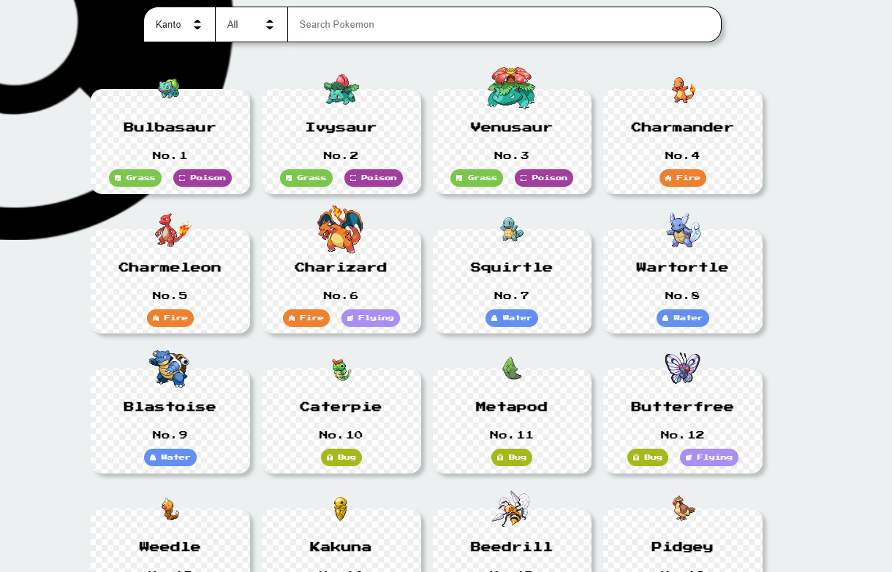
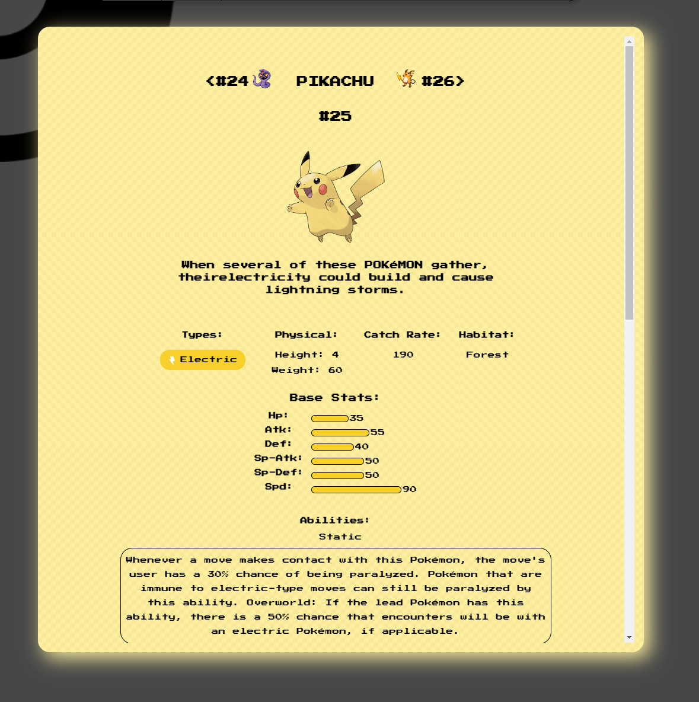

# Pokedex
## About
A react app where users can view a list of pokemon from different regions along with their data. Pokemon data were taken from the [PokéAPI](https://pokeapi.co/)

<p>


</p>

## Deploy
```
git clone, install, and then npm start
```
